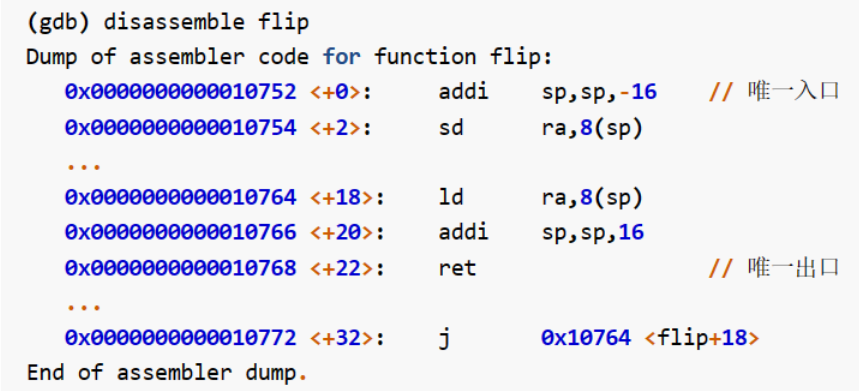

# 引言

生成二进制代码，依赖以编译器为主的开发环境，运行依赖以操作系统为主的执行环境。

**qemu模拟器**：模拟一台计算机的硬件，比如在x86的架构上，运行基于rv64架构的程序。

**qemu的工作过程**：bootloader硬件初始化->内核镜像->建立栈空间，清空.bss，执行app->app调用libOS的服务。

# 应用程序执行环境与平台支持

```
cargo new os --bin
```

cargo是rust包管理，新建一个包，os是名字，--bin是可执行程序。

```
//os
cargo run
```

构建并运行，可执行文件在target/debug/os

**标准库的作用**：直接或简介通过系统调用实现某些功能，进行初始化，然后跳转到main入口。同时提供一些封装了系统调用的函数，所以在裸机上不能使用std，一般依赖core。

**目标三元组**：根据CPU的架构和软件约定一组ISA，同一语言的程序在不同架构上运行需要不同的编译器。Rust语言的编译器的目标平台三元组，架构-CPU厂商-操作系统-运行时库（gnu是库，elf是不依赖库直接形成可执行文件，elf是可执行文件）

# 移除标准库依赖

**库操作系统**：一种os的设计方式，以库函数的形式存在，为app提供os的功能。

**交叉编译**：在x86平台上编译目标平台为rv64的程序。

std的作用还包括一些后备功能，比如panic处理，所以即使#![no_std]也无法运行，需要手动写一个panic，再导入main.rs中，如下：

```
// os/src/main.rs
#![no_main]
// 没有传统意义的main函数，否则需要依赖std初始化，再进入main
#![no_std]
mod lang_items;
```

```
// os/src/lang_items.rs
use core::panic::PanicInfo
#[panic_handler]
// 一个标志，通知编译器panic!宏在这里
fn panic(_info: &PanicInfo) -> !{
    loop {}
}
```

**summary**：在可执行程序中，std会先进行一些初始化，再跳转到main入口。这一节先是去除了需要使用std的功能（main和println!宏），然后写了一些必要的功能（panic处理），再导入main.rs，rust-objdump反汇编发现此时是一个空程序。

# 内核的第一条指令

```
qemu-system-riscv64 \
    -machine virt \
    -nographic \
    -bios ../bootloader/rustsbi-qemu.bin \
    -device loader,file=target/riscv64gc-unknown-none-elf/release/os.bin,addr=0x80200000
```

**qemu的启动过程**：firmwa固件先执行（0x1000），再转移到bootloader（0x800000000），再到内核镜像（0x802000000）。

**数据段的内存布局**：

- .rodata：const
- .data：初始化的全局变量
- .bss：保存程序中那些未初始化的全局数据，通常由程序的加载者代为进行零初始化，即将这块区域逐字节清零
- 堆：malloc
- 栈：局部变量

**release和debug生成可执行文件的区别：**
优化级别不同，release的优化更多。

# 为内核支持函数调用

为了用rust来写内核，要把控制权转给rust写的函数入口，需要一些汇编代码在entry.asm里面移交控制权。

**函数调用的过程：**
取指，执行，PC+4，存储到ra，保存ra。调用函数，被调用者保存，执行函数，ret返回。

**栈帧：**
程序的栈区域的某一段属于某一被调用的函数，fp和sp来标记这段空间。（意味着fp和sp是一个被调用者保存寄存器，因为进入函数时需要分配，sp-imm，函数结束恢复sp+imm）

**分配并使用栈：**
进入rust_main之前，建立一段栈空间，将sp指向栈底高地址，暂时放入.bss段的开头位置。并且在entry.asm里面将.bss的内容初始化为0。

# 基于SBI服务完成输出和关机

**使用RustSBI的服务：**
os内核和RustSBI两种软件之间的接口是SBI，SBI会对os内核提供一些功能，但是不能直接使用，而sbi-rt封装了这些功能，引入依赖后可以使用。

# 练习

如果使用/proc/pid/maps查看程序运行中的地址空间，在程序睡眠之前没有进行堆上的分配，不会显示[heap]。

操作系统向编译器提供依赖的程序库。

qemu的模拟过程：firmware进行初始化以后，跳转到bootloader（这里是rustSBI），对部分硬件初始化再跳转到内核起始地址，再sret到应用程序。

为什么应用程序编程不用创建栈空间？因为还没有进行链接和加载到内存，可能需要重定位，而且这个过程是os完成的。答案的剩下部分没看懂。

不保存栈帧fp，能不能完成恢复操作？
总结题目中的情况就是，现在执行flip，刚进入，还没进行分配栈帧和保存寄存器，从ra可以看出是被flap调用的，此时的sp刚好是上一个flap栈帧的栈顶，且栈帧是16字节，所以sp偏移8个字节可以读出更上一层的调用者，上一层的flap是被更上一层的flap调用的，且sp偏移16就是更上一层flap的栈顶，递归判断可以完成恢复。

问题：什么时候递归结束，sp=之前设置的top吗？

用qemu运行一个基于rcore的程序：
第一步进入os目录，make run。第二步输入程序名字。

```
cd /path/to/os/
make run
```

# 实验

```
echo -e "\x1b[31mhello world\x1b[0m"
```

使用 ANSI 转义序列来设置文本的颜色。\x1b 是 ASCII Escape 字符的十六进制表示，而 \x1b[31m 表示设置颜色为红色。\x1b[0m 用于重置颜色到默认值。所以效果是将 "hello world" 输出到终端，颜色为红色。

# 汇报

这一章的主要内容是qemu启动后的简单过程，首先由firmware固件的几句汇编指令进行一些初始化的操作，紧接着pc指向0x80000000的bootloader（rCore使用的是rustSBI），bootloader进行部分硬件的初始化后跳转到0x80200000处的内核第一条指令开始执行。本书的内核以函数库的形式存在。

其中关于内核的设计，std库直接或间接使用了内核提供的系统调用，对程序进行初始化或者封装一些功能（println！宏，panic！宏等），所以基于裸机开发无法依赖std库（但是可以依赖core库）。

也就失去了传统意义上的main入口的含义，替换为手写的entry.asm代码，在这段代码中首先进行一些初始化操作（比如初始化栈），再进入rust_main。但是panic！的错误处理是必须存在的，不能简单注释。

进入rust_main以后，清空.bss段，这个段通常存储没有被初始化的全局变量，再执行其他语句，语句所依赖的功能是通过sbi-rt封装的SBI功能实现的。

程序在执行过程中，如果存在函数调用关系，被调用者函数的开头，先开辟栈空间，再把$ra压栈，在函数结束位置ret可以进行恢复，返回调用函数中。




