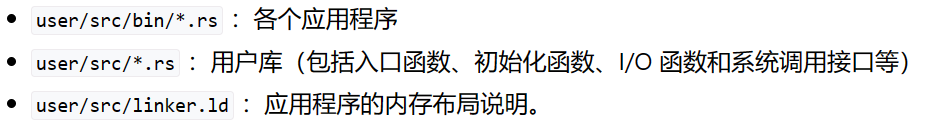

# 引言

测试代码已过。

# 特权级机制

如果没有特权级机制，kernel和app编译的时候被链接到一起成为一个program，app的错误会导致整个program不可用，os也无法运行。

为了解决这个问题，进行特权级划分把os和app隔离开。限制app不能访问任意地址；不能使用某些指令（本章）。

**软硬件协同：**

处理器设置两个安全等级，以及对应的指令集，执行指令之前进行特权级检查（rsicv硬件实现）。

**os提供服务，如何交互：**

采用函数调用的方式（call ret）会绕过硬件的特权级检查。

**硬件：**
riscv提供新的机器指令，执行环境调用ecall（用户->内核），执行环境返回eret（sret内核->用户）。

**软件：**
os提供相应的代码，执行sret之前恢复现场和执行ecall之后检查系统调用参数，确定安全。

属于S模式的特权指令：本身是高级的如sret，或是访问那些高级特权级的寄存器和内存，比如CSR，状态控制寄存器（控制和描述S级的行为和状态）

# 实现应用程序

批处理系统逐个加载运行app，前提是app是在U模式下运行的。

**要点**

- 内存布局
- app发出的系统调用ABI

应用程序放在/usr下，和裸机应用的区别是，目录文件结构和内存布局。

**程序启动过程简述：**

程序的起始物理地址设置为0x80400000，把entry放在最前面，entry是lib.rs用户库的一个入口，开始运行就先进入用户库进行初始化，比如清空.bss段，然后再返回程序中进行执行。

如果程序要使用系统调用，就用ecall，会触发trap到S模式，相关的参数放在a0-a7寄存器，也就是x10-x17，a0存储返回值，a7传递调用id。riscv的寄存器x0-x31，其中x1别名ra，是第一章函数调用的返回地址。

# 实现app的总结

和前面的os都是基于裸机的软件，但是在app里存在一些封装，类似于系统调用，因为这些封装的功能，让app现在看起来是运行在os内核之上的。

app在bin里面，运行app前需要一些初始化工作，在os里面是直接在main.rs里面写，在app中是在依赖库lib.rs中写的，而且lib中有一些封装后的系统调用操作，本质上这都是API，只是封装后更符合实际。进行.bss的清空进行初始化工作以后进入app的main，当app需要一些syscall的时候，前面引入宏的时候已经把lib中封装好的功能导入了。

# 实现批处理操作系统

**将应用程序链接到内核 - link_app.S:**

把app的elf文件作为内核的数据段和内核绑定在一起，运行的时候一块加载。也就是把这些app的二进制可执行文件嵌入到这个地方，跟os链接起来，incbin就是一个嵌入二进制文件的指令。

**找到app并加载 - AppManager：**

app数量，当前执行的app，每个app的开始地址。初始化过程是从link_app中找到对应信息并进行赋值。

AppManager的方法：load_app，把要执行的app的镜像加载到0x804000000，实际上整个过程类似于复制。

**特权级的切换：**

应用程序进行syscall（例如ecall）的时候进行trap处理，要切换到S级。结束的时候sys_exit要切换回U级。

**切换之前：**

保存通用寄存器和CSR。

**ecall后硬件：**

自动修改CSR，sstatus中的SPP是当前特权级，sepc是返回的地址，scause是trap的原因。CPU跳到stvec处执行，设置当前是S级，然后开始执行。

处理结束，sret指令，CPU会修改SPP，然后跳到spec回去执行。

**用户栈和内核栈:**

UserStack和KernelStack，通过修改sp可以切换两个栈。

**trap上下文：**

先通过__alltraps把trap上下文保存到内核栈，跳到trap_handler执行，__restore恢复，sret返回。

**scratch：**

U级储存内核栈的sp，S级时可以用来保存用户栈的sp。

**handler：**

根据trap类型进行处理

- 系统调用：修改spec+4
- 非法：run_next_app

**run_next_app:**

复用restore，往内核栈压入一个trapcontext，再进行context恢复。
