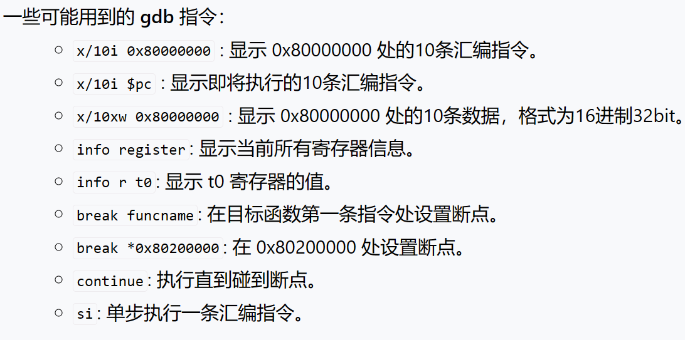

# 用包管理器cargo创建rust可执行项目
```
cargo new [name] --bin
# e.g.
cargo new os --bin
```

# 新建cargo配置文件
```
// /app/.cargo/config

// 构建的配置，这是基于riscv64裸机的可执行文件，告知编译器应该把我的项目编译成在什么环境下运行的可执行文件

[build]
target = "riscv64gc-unknown-none-elf"

// 指定编译过程的链接要求，放在linker.ld里，且强制保留fp这个栈帧指针，调试会用到

[target.riscv64gc-unknown-none-elf]
rustflags = [
    "-Clink-args=-Tsrc/linker.ld", "-Cforce-frame-pointers=yes"
]
```
# make run直接使用qemu进行构建并运行
```
# /os/ 
make run
```

# main.rs移除std依赖
```
// /os/src/main.rs

#![no_std]
#![no_main]
```
# 摆脱std的某些必要处理
```
// os/src/lang_items.rs

use core::panic::PanicInfo;

//一个标记，代表panic处理要进入的处理
#[panic_handler]
fn panic(_info: &PanicInfo) -> ! {
    loop {}
}
```
# 初始化以后要跳转到main，由于没有入口，就要自己设置 _start
```
// /os/src/main.rs

//写了一个entry里面有_start，在main里面标记一下

global_asm!(include_str!("entry.asm"));

// os/src/entry.asm
    .section .text.entry
    .globl _start
_start:
    la sp, boot_stack_top
    call rust_main

    .section .bss.stack
    .globl boot_stack_lower_bound
boot_stack_lower_bound:
    .space 4096 * 16
    .globl boot_stack_top
boot_stack_top:

```

# 链接脚本
```
// /os/src/linker.ld

// 目标平台
OUTPUT_ARCH(riscv)

// 入口处
ENTRY(_start)

// 链接以后放在哪里
BASE_ADDRESS = 0x80200000;

// 内存布局
SECTIONS
{
    // 最开始的地址就是放置位置
    . = BASE_ADDRESS;
    skernel = .;

    // 代码段
    stext = .;
    .text : {
        // 入口放在最前面

        *(.text.entry)
        *(.text .text.*)
    }
    
    // 内存对齐
    . = ALIGN(4K);
    etext = .;

    // const
    srodata = .;
    .rodata : {
        *(.rodata .rodata.*)
        *(.srodata .srodata.*)
    }

    . = ALIGN(4K);
    erodata = .;

    // 全局变量
    sdata = .;
    .data : {
        *(.data .data.*)
        *(.sdata .sdata.*)
    }

    . = ALIGN(4K);
    edata = .;

    // 未初始化的全局变量
    .bss : {
        *(.bss.stack)
        sbss = .;
        *(.bss .bss.*)
        *(.sbss .sbss.*)
    }

    . = ALIGN(4K);
    ebss = .;
    ekernel = .;

    /DISCARD/ : {
        *(.eh_frame)
    }
}
```
# 编译
```
cargo build --release
```

# 链接完成，内核开头有元数据，去掉
```
rust-objcopy --strip-all target/riscv64gc-unknown-none-elf/release/os -O binary target/riscv64gc-unknown-none-elf/release/os.bin
```

# 在qemu上启动
```
qemu-system-riscv64 \
    -machine virt \
    -nographic \
    -bios ../bootloader/rustsbi-qemu.bin \
    -device loader,file=target/riscv64gc-unknown-none-elf/release/os.bin,addr=0x80200000 \

    # gdb调试
    -s -S
```

# 新终端gdb调试
```
riscv64-unknown-elf-gdb \
    -ex 'file target/riscv64gc-unknown-none-elf/release/os' \
    -ex 'set arch riscv:rv64' \
    -ex 'target remote localhost:1234'
```
